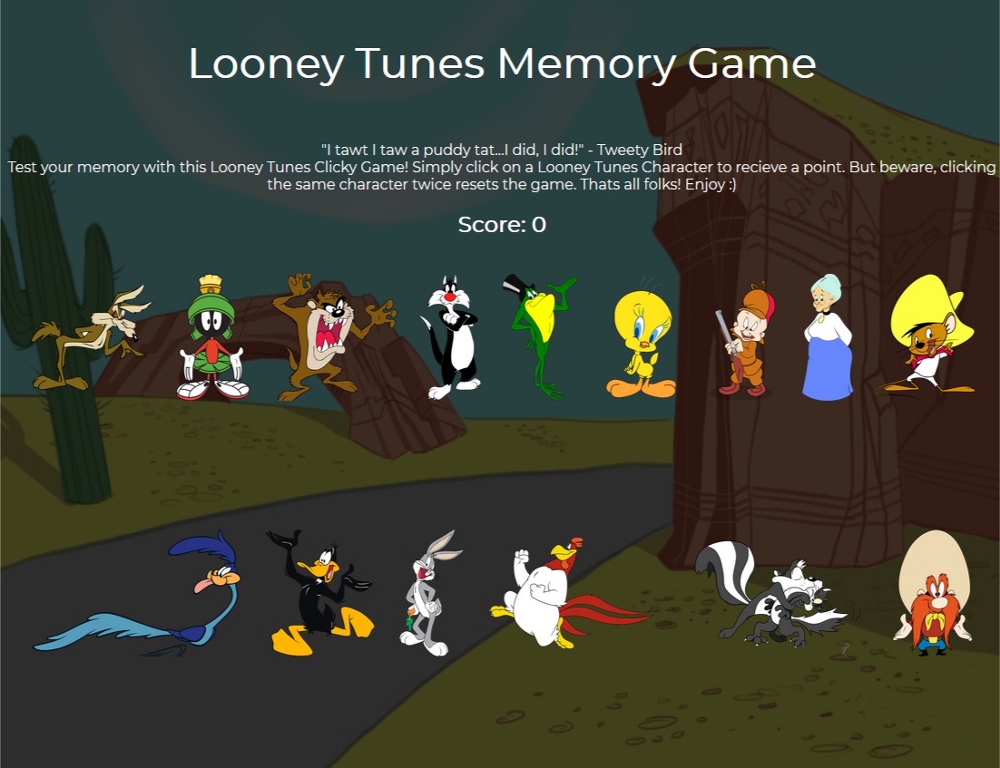
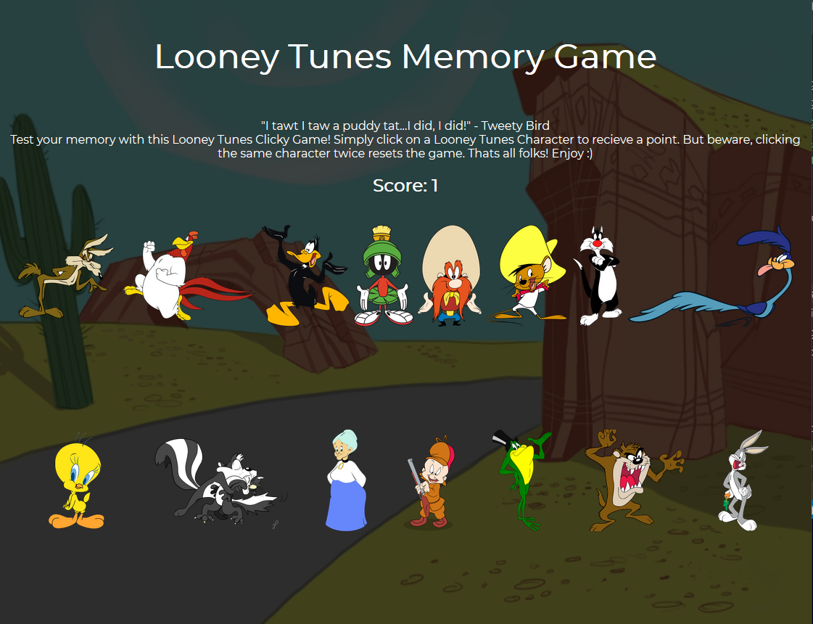
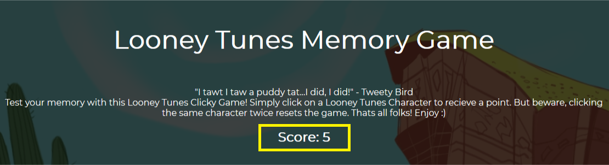

# Looney Tunes clicky-game

Heroku link: 
https://pure-hamlet-54141.herokuapp.com/

------

## Objective:
The objective of this game is to test user's memory, seeing how long they can last before clicking on the same character. The theme of the game is Looney Toons.

## Overview:
This is a react app, it uses the React javascript framework to dynamically render the characters every time a character is clicked or if the page is reloaded. When the user clicks on an image that they have already clicked on they are prompted that they have lost and a new game begins. 

## Instructions:

* When the page loads, a new game begins. the user is to click on a character.

* Once clicked, the characters switch spots to a new location. At this point, the user is to click on a new character. 

* This continues until the user has selected all the characters, without selecting the same one more than once. Each time the user selects a new character, their score increases. If the users selects a character or image that they have already selected before then they loose the game. the score resets to 0 and they can play again.
